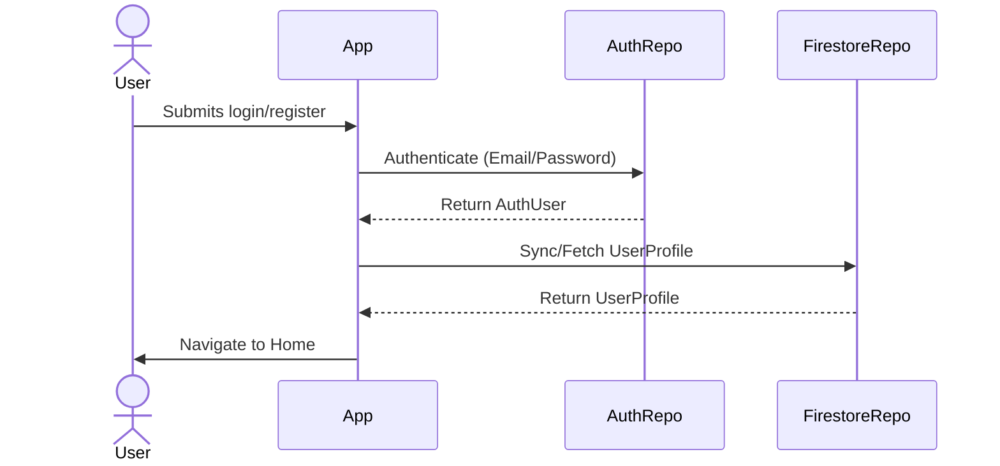
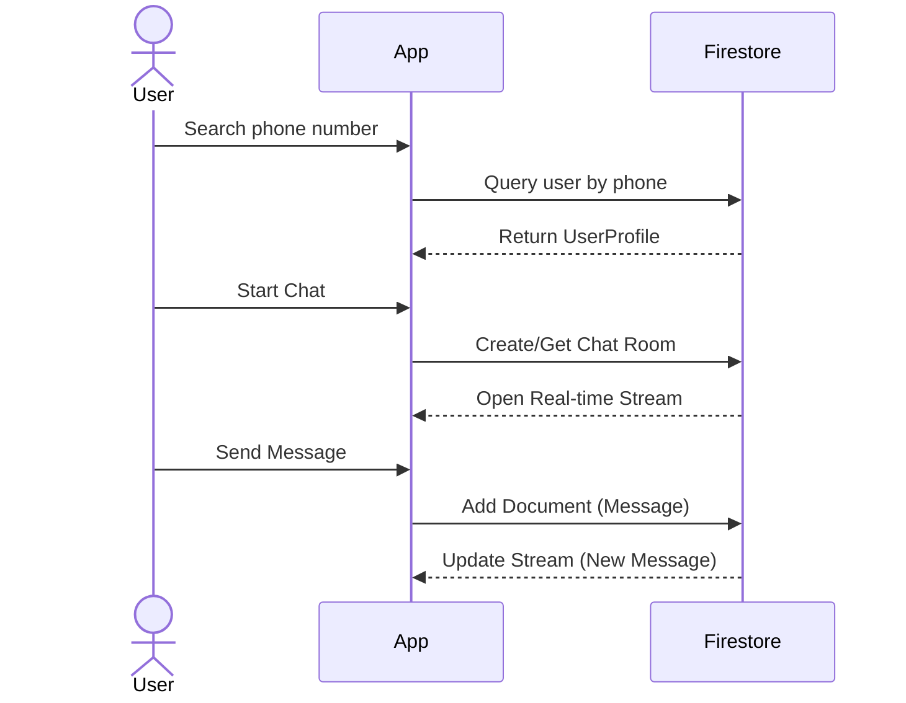

# CaffChat

A real-time chat application built with Flutter, Firebase, and Clean Architecture principles.

## 🚀 Features

- **Real-Time Messaging**: Instant text-based communication.
- **Phone Number Search**: Easily discover and start chats with other users via phone number validation.
- **User Presence**: Real-time tracking of online/offline status.
- **Localization (i18n)**: Multi-language support (English and Indonesian).
- **Secure Authentication**: Firebase Auth for login and registration.

## Tech Stack

| Category | Technology |
|----------|------------|
| Framework | Flutter (Dart 3.10+) |
| State Management | Riverpod + Riverpod Generator |
| Routing | GoRouter |
| Authentication | Firebase Auth |
| Database | Cloud Firestore |
| Code Generation | Freezed, JSON Serializable, Build Runner |
| Font | Poppins (custom asset) |
| Hooks | Flutter Hooks + Hooks Riverpod |
| Localization | `flutter_localizations` |

## Architecture

The project follows **Clean Architecture** with a clear separation into four layers. Dependencies flow inward — outer layers depend on inner layers, never the reverse.

```text
┌─────────────────────────────────────────────────────┐
│                   Presentation                       │
│          (Pages, Widgets, Providers)                 │
├─────────────────────────────────────────────────────┤
│                     Domain                           │
│        (Entities, Repository Interfaces,             │
│                  Use Cases)                           │
├─────────────────────────────────────────────────────┤
│                      Data                            │
│       (Repository Implementations, Models)           │
├─────────────────────────────────────────────────────┤
│                      Core                            │
│    (Config, Design System, Router, Utils)            │
└─────────────────────────────────────────────────────┘
```

### Domain Layer (`lib/domain/`)

The innermost layer containing business logic with zero framework dependencies.

- **`entities/`** — Immutable data classes generated with Freezed.
  - `auth/auth_user.dart` — Lightweight auth identity.
  - `user/user_profile.dart` — Full user profile (with online status).
  - `chat/chat.dart` & `chat_message.dart` — Real-time chat and message entities.
  - `result/result.dart` — Sealed `Result<T>` class for explicit error handling.
- **`repositories/`** — Abstract interfaces (contracts).
  - `auth_repository.dart` — Auth operations.
  - `user_profile_repository.dart` — User profile CRUD & search via phone number.
  - `chat_repository.dart` — Chat creation, message sending, and real-time streams.
- **`usecase/`** — Single-responsibility interactors.

### Data Layer (`lib/data/`)

Implements domain contracts with concrete Firebase services.

- **`repositories/`** — Concrete implementations.
  - `firebase_auth_repository.dart` — Wraps `FirebaseAuth`.
  - `firestore_user_profile_repository.dart` — Wraps `Firestore` for profile/presence.
  - `firestore_chat_repository.dart` — Wraps `Firestore` for real-time messaging.
- **`models/`** — Data transfer objects handling serialization between Firestore and Domain.

### Presentation Layer (`lib/presentation/`)

UI components and state management via Riverpod.

- **`pages/`** — Full-screen views (`splash/`, `auth/`, `home/`, `chat/`, `settings/`).
- **`providers/`** — Generated Riverpod providers handling real-time streams (like chat streams, active user presence).
- **`widgets/`** — Reusable UI components.

### Core Layer (`lib/core/`)

Shared utilities and infrastructure.

- **`config/`** — Environment configuration (`dev`, `stag`, `prod`).
- **`design/`** — Design system tokens (colors, text, spacing, radius, theme).
- **`router/`** — GoRouter configuration with auth-guarded redirects.
- **`utils/` & `exceptions/`** — Logger and Custom app exceptions.

## Application Flow

### 1. Authentication Flow


### 2. Chat & Messaging Flow


## Firebase Services

| Service | Purpose |
|---------|---------|
| Firebase Auth | Email/password authentication |
| Cloud Firestore | User profiles, chats, and messages data storage |

### Firestore Security Rules
- Authenticated users can read relevant chat and profile documents.
- Users can only create or update their own data.
- Client-side deletion is blocked.

## Getting Started

### Prerequisites
- Flutter SDK `^3.10.1`
- Firebase CLI & active Firebase project

### Setup
```bash
# Install dependencies
flutter pub get

# Run code generation
dart run build_runner build --delete-conflicting-outputs
```

### Running
```bash
# Development
flutter run -t lib/main_dev.dart

# Production
flutter run -t lib/main.dart
```

## Design Principles
- **SOLID** — Single responsibility in use cases; dependency inversion via repositories.
- **DRY** — Centralized design tokens and widgets.
- **KISS & YAGNI** — Minimalistic feature-driven approach.
- **Explicit Error Handling** — Using sealed `Result<T>` instead of relying solely on exceptions.
